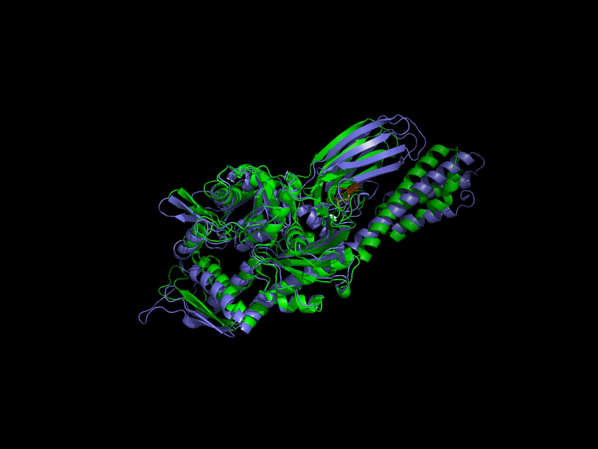
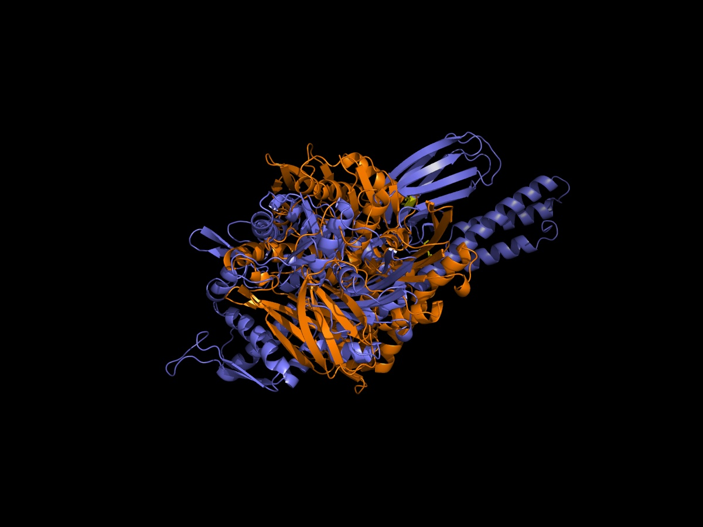

# In Silico Analysis of Bennu-Derived Non-Canonical Amino Acids on DnaK Chaperone Structure and Allostery

**Undergraduate Thesis — Bioengineering**
Pelinsu Eda Şentürk · Advisor: Dr. Saliha Ece Acuner
Faculty of Engineering and Natural Sciences, Department of Bioengineering · 2026

---

## Overview

This project investigates how **non-canonical amino acids identified in samples returned by NASA/JAXA's Hayabusa2 mission from asteroid Bennu** — norvaline (NVA), norleucine (NLE), isoleucine (ILE), valine (VAL), α-aminoisobutyric acid (AIB), α-aminobutyric acid (ABA), and β-alanine (BAL) — affect the **structural stability and allosteric function of the *E. coli* DnaK (HSP70) chaperone protein**.

Two functionally critical regions of DnaK (PDB: [4B9Q](https://www.rcsb.org/structure/4B9Q)) were targeted:

- **Interdomain linker** (L390–L391) — the hydrophobic segment mediating allosteric communication between the nucleotide-binding domain (NBD) and substrate-binding domain (SBD)
- **SBD β-sandwich substrate-binding region** (A429–A435)

The work combines **free energy calculations (ΔΔG)**, **AI-based structure prediction**, and **structural visualization** to evaluate amino acid substitution tolerance — and frames the results within an astrobiology context: could amino acids delivered to early Earth via asteroid impacts have been compatible with primordial chaperone-like proteins?

---

## Methodology

| Step | Tool | Purpose |
|---|---|---|
| 1 | **PyRosetta** (`ref2015` score function) | Rigid-backbone ΔΔG calculations for each mutation |
| 2 | **Boltz-2** (via [tamarind.bio](https://www.tamarind.bio/)) | AI-based 3D structure prediction for mutant proteins, including non-canonical residues |
| 3 | **PyMOL** | Superposition and visualization of mutant vs. wild-type structures |

> Note: Boltz-2 and PyRosetta are third-party tools used as part of this analysis (not original code from this project). This repository includes the **input configurations**, **predicted output structures**, and **analysis scripts** used to run and interpret them.

---

## Key Findings

### Linker Region (L390–L391)

| Amino Acid | Position | ΔΔG (REU) | Result |
|---|---|---|---|
| NVA | L390 | −3.951 | ✅ Stabilizing |
| NVA | L391 | −3.751 | ✅ Stabilizing |
| NVA | L390+L391 | **−6.090** | ✅ Stabilizing |
| VAL | L390 | −4.905 | ✅ Stabilizing |
| VAL | L391 | +2.418 | ⚠️ Mild destabilization |
| ILE | L390+L391 | +72.800 | ❌ Severe destabilization |
| AIB | L390+L391 | +25.364 | ❌ Destabilizing |
| NLE / ABA / BAL | — | N/A | Rotamer library / backbone incompatibility |

### SBD Region (A429–A435)

| Amino Acid | Position | ΔΔG (REU) | Result |
|---|---|---|---|
| NVA | A429 | −2.578 | ✅ Stabilizing |
| NVA | A435 | +5.354 | ❌ Destabilizing |
| ILE | A429+A435 | **+517.966** | ❌ Severe destabilization |
| VAL | A429+A435 | +79.372 | ❌ Severe destabilization |
| AIB | A429+A435 | +121.645 | ❌ Severe destabilization |

**Headline result:** Norvaline (NVA) is well tolerated in the DnaK linker region and produces a strong stabilizing effect (ΔΔG = −6.09 REU for the double mutant), while preserving the global backbone fold in Boltz-2 structure predictions — consistent with the hypothesis that this amino acid could have been compatible with primordial chaperone proteins.

---

## Repository Structure

```
dnak-noncanonical-aa/
├── README.md
├── report/
│   ├── DnaK_Thesis_Report_TR.docx      # Full thesis (APA7, Turkish)
│   └── DnaK_Thesis_Report_EN.pdf       # English version
├── presentation/
│   ├── DnaK_Presentation_TR.pptx       # Defense presentation (Turkish)
│   └── DnaK_Presentation_EN.pptx       # English summary version
├── pyrosetta_ddg/
│   ├── calculate_ddg.py                # ref2015 ΔΔG calculation script
│   ├── ddg_results.csv                 # Full 41-row results table
│   └── README.md
├── boltz2_predictions/
│   ├── jobs.csv                        # 11 completed Boltz-2 jobs
│   ├── generate_configs.py             # YAML config generator
│   ├── 4b9q_chainA.fasta                # placeholder sequence
│   ├── inputs/                         # generated YAML configs
│   └── README.md
├── pymol_visualizations/
│   ├── images/                         # 30 PNGs (close/mid/wide × 10 mutants)
│   ├── scripts/
│   │   ├── render_mutant.py
│   │   └── README.md
└── (figures referenced below are inside pymol_visualizations/images/)
```

---

## Sample Visualizations

**Linker region — NVA double mutant (L390+L391NVA)**
Strongest stabilizing effect observed (ΔΔG = −6.09 REU). Global backbone fold preserved.



**SBD region — ILE double mutant (A429+A435ILE)**
Most severe destabilization observed (ΔΔG = +517.97 REU). Marked backbone distortion in the β-sandwich.



---

## Tools & Technologies

- **PyRosetta** (Rosetta `ref2015` energy function) — protein energy calculations
- **Boltz-2** (via tamarind.bio) — AI-based protein structure prediction
- **PyMOL 2.x** — molecular visualization
- **Python** — data processing and analysis

---

## Background & Context

In 2023, NASA/JAXA's Hayabusa2 mission returned samples from the carbonaceous near-Earth asteroid Bennu containing several non-canonical amino acids not found among the standard 20 used in terrestrial biology (Glavin et al., 2023). This raises the question of whether such amino acids — delivered to early Earth via asteroid impacts — could have been structurally and functionally compatible with primitive protein machinery.

DnaK, an *E. coli* HSP70 chaperone, was used as a model system due to its well-characterized **allosteric mechanism**: a short interdomain linker mediates communication between its ATPase domain and substrate-binding domain, making it a sensitive probe for evaluating amino acid substitution effects on both stability and function (Bertelsen et al., 2009; Swain et al., 2007).

---

## Limitations & Future Work

- ΔΔG calculations used a rigid-backbone approach (no minimization); Flex ddG or Rosetta Relax would improve accuracy
- NLE, ABA, and BAL could not be evaluated via PyRosetta due to missing rotamer libraries
- Boltz-2 predictions are static; molecular dynamics simulations are needed to capture ATP/ADP-dependent allosteric dynamics
- Substrate docking analysis is planned as a follow-up

---

## References

- Bertelsen, E. B., et al. (2009). Solution conformation of wild-type *E. coli* Hsp70 (DnaK) chaperone complexed with ADP and substrate. *PNAS*, 106(20), 8471–8476.
- Glavin, D. P., et al. (2023). The significance of meteoritic amino acids. *Chemical Reviews*, 123(21), 12478–12528.
- Park, H., et al. (2016). Simultaneous optimization of biomolecular energy functions on features from small molecules and macromolecules. *JCTC*, 12(12), 6201–6212.
- Swain, J. F., et al. (2007). Hsp70 chaperone ligands control domain association via an allosteric mechanism mediated by the interdomain linker. *Molecular Cell*, 26(1), 27–39.

---

## Author

**Pelinsu Eda Şentürk**
Bioengineering Undergraduate Student
Faculty of Engineering and Natural Sciences
*Advisor: Dr. Saliha Ece Acuner*
